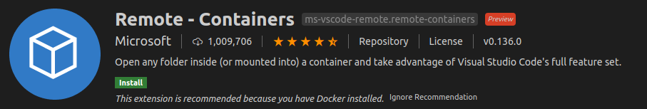
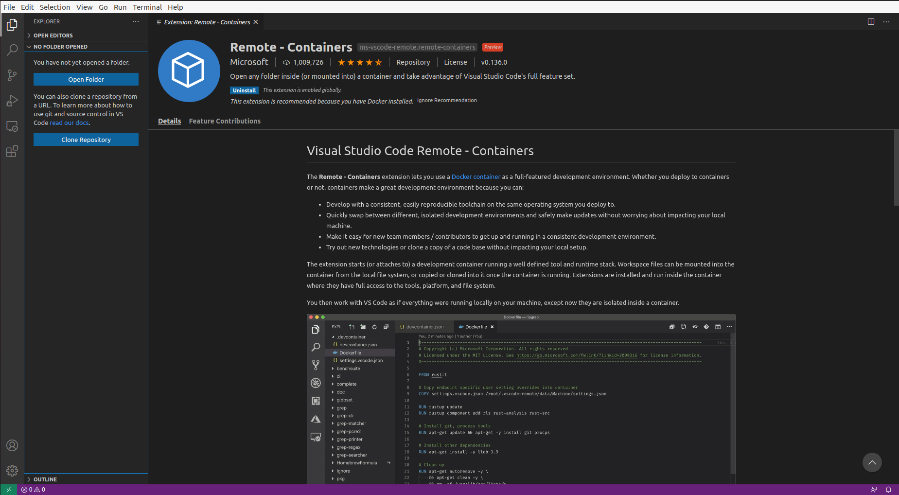
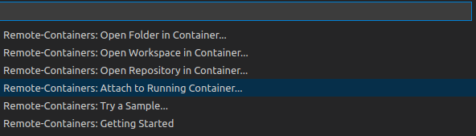
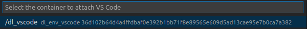

# Build docker image
```bash
$ docker build --rm -t dl_env_vscode \
--build-arg USER_ID=$(id -u) \
--build-arg GROUP_ID=$(id -g) \
--build-arg USER=${USERNAME} .
```

# Run docker container
```bash
$ docker run -it -d --name dl_vscode  dl_env_vscode
```

# Set vscode

1. Install extension: Remote-Conainers 

2. Click the arrow at bottom left

3. Select Remote-Containers: Attach to Running Container...

4. Select the container you want to use.
